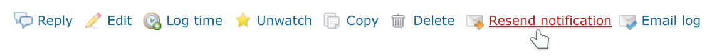
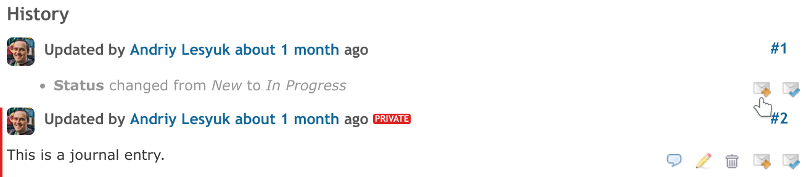

# That Resent Notification Plugin

This plugin adds icons to issue's and issue history entry's contextual menus,
that allows to repeat the email notification for the issue or the issue history entry correspondingly:

Note: When the plugin sends the email notification, it uses the current state of the issue -
not the state, that the issue have had at the moment of creating the issue or the issue history entry!

## Installation

- Move `that_resent_notification` directory to the `plugins` directory of Redmine
- Restart Redmine

## License

GNU General Public License (GPL) v2.0

## Used Icons

- https://www.iconfinder.com/icons/95948/envelope_right_icon (Icojam)
